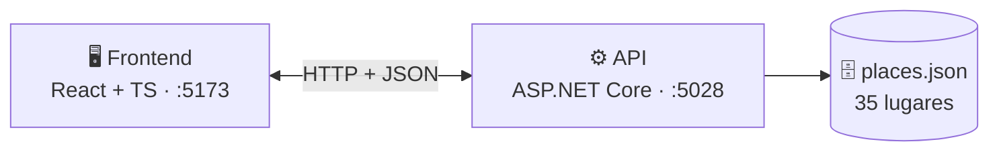

#  GeoVista — Descubre el mundo al azar

<p align="center">
  
  
  
  
</p>

<p align="center">
  <strong>Pulsa 🎲 Explorar y teletranspórtate a un rincón del planeta</strong> — con foto, coordenadas de Google Maps y vista 360° con Street View.
</p>

<p align="center">
  🗿 Monumentos &nbsp;·&nbsp; 🏛️ Plazas &nbsp;·&nbsp; 🏞️ Paisajes &nbsp;·&nbsp; ⛰️ Montañas
</p>

---

## ✨ Características

- 🎲 **Explorar al azar** — sorteo global o filtrado por categoría (`Todas · Monumento · Plaza · Paisaje · Montaña`)
- 🌐 **Globo 3D giratorio de fondo** con marcadores clicables (`react-globe.gl` + `three.js`)
- 🚶 **Experiencia 360°** — Street View a nivel de calle, mapa embebido y enlaces a Google Maps / Google Earth (sin API key)
- 🖼️ **Imágenes 100 % en línea** — nada se descarga al proyecto; triple respaldo automático anti-roto
- ⚡ **Optimizado** — chunks lazy, imágenes al tamaño justo, 3D pausable, `Cache-Control` en la API
- 📱 Responsive + `prefers-reduced-motion`

## 🧱 Arquitectura

Cliente-servidor en 3 niveles, desacoplado por contrato REST/JSON:



| Nivel | Proyecto | Responsabilidad |
|---|---|---|
| Presentación | `frontend/` | SPA: renderiza, pide datos, no tiene lógica de negocio |
| Lógica / API | `backend/GeoVista.Api/` | Minimal API: recursos, filtro por categoría, sorteo aleatorio |
| Datos | `Data/places.json` | Catálogo con coordenadas reales y URLs de foto |

## 🔌 Endpoints

| Método | Ruta | Descripción |
|---|---|---|
| `GET` | `/api/places` | Todos los lugares (cache 1 h) |
| `GET` | `/api/places/random?category=Montaña` | Sorteo global o por categoría (nunca se cachea) |
| `GET` | `/api/places/{id}` | Detalle, p. ej. `/api/places/zona-colonial` |
| `GET` | `/api/places/categories` | `["Montaña","Monumento","Paisaje","Plaza"]` |

## 📁 Estructura

```
GeoVista/
├── frontend/                 # React + TypeScript + Vite
│   └── src/
│       ├── api/              # fetch a la API + fallback local
│       ├── components/       # GlobeBackground, PlaceCard, PlaceImage, ExploreModal
│       ├── data/             # fallbackPlaces (la app funciona sin backend)
│       └── App.tsx
├── backend/GeoVista.Api/     # ASP.NET Core 10 Minimal API
│   ├── Models/Place.cs       # record inmutable
│   ├── Data/places.json      # 35 lugares
│   └── Program.cs            # endpoints + CORS + compresión + caché
└── skills/                   # guías de .NET, Playwright y UI premium
```

## 🚀 Puesta en marcha

Requisitos: [.NET 10 SDK](https://dotnet.microsoft.com/download) y [Node.js 20+](https://nodejs.org/).

```powershell
# Terminal 1 — API (http://localhost:5028)
dotnet run --project backend/GeoVista.Api --urls "http://localhost:5028"

# Terminal 2 — Web (http://localhost:5173)
npm --prefix frontend install
npm --prefix frontend run dev
```

> Sin la API levantada, la web sigue funcionando con el catálogo local de respaldo.

## ⚡ Rendimiento

- JS inicial: **~236 KB (74 KB gzip)** — `three.js` (2 MB) y `framer-motion` llegan en lazy
- Imágenes de tarjetas a `w=600`, modal a `w=1200`, `loading="lazy"` + `decoding="async"`
- Rotación 3D pausada con pestaña oculta, `prefers-reduced-motion` o modal abierto
- API con `Cache-Control` (`public,max-age=3600` en catálogo, `no-store` en sorteo) y compresión gzip/brotli

## 🗺️ Destinos incluidos

35 lugares en 20+ países: Torre Eiffel, Machu Picchu, Gran Muralla, Chichén Itzá, Salar de Uyuni, Cartagena, Perito Moreno, Plaza Roja, Lago Baikal… y 4 de 🇩🇴 República Dominicana (Zona Colonial, Punta Cana, Bahía de las Águilas, Pico Duarte).

## 🛣️ Roadmap

- [x] Explorar al azar + categorías
- [x] Vista 360° con Street View
- [x] Optimización de carga
- [ ] Búsqueda por texto
- [ ] Favoritos (`localStorage`)
- [ ] Base de datos real (EF Core + SQLite/PostgreSQL)
- [ ] Tests (xUnit + Playwright)

---
<p align="center">Hecho con 🌎 React · TypeScript · ASP.NET Core</p>
